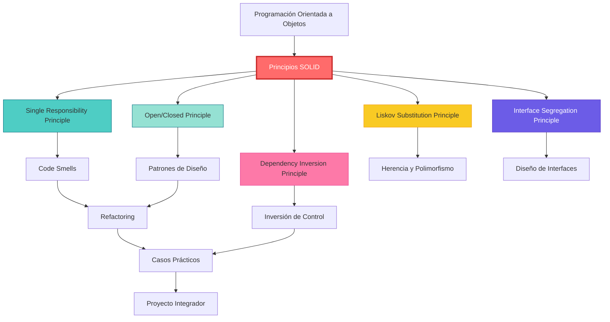

# ARQUITECTURA CURRICULAR: PRINCIPIOS SOLID EN PROGRAMACIÓN ORIENTADA A OBJETOS

## METADATA

- **Complejidad**: Media
- **Duración estimada**: 90-120 horas (3 meses)
- **Audiencia objetivo**: Desarrolladores y técnicos con experiencia en programación
- **Prerrequisitos obligatorios**:
  1. Programación Orientada a Objetos (clases, herencia, polimorfismo, encapsulación)
  2. Experiencia práctica con al menos un lenguaje OOP (Java, C#, JavaScript, Python, TypeScript)
  3. Conocimientos básicos de patrones de diseño
  4. Comprensión de testing unitario
- **Fecha de diseño**: 2025-12-07

## MAPA CONCEPTUAL



## OBJETIVOS GENERALES DEL CURSO

1. **Comprender** los 5 principios SOLID y su impacto en la calidad del código
2. **Aplicar** cada principio SOLID en el diseño y refactorización de sistemas reales
3. **Analizar** código existente para identificar violaciones de SOLID y proponer mejoras
4. **Evaluar** arquitecturas de software según criterios de mantenibilidad y extensibilidad
5. **Crear** soluciones de software que demuestren adherencia a principios SOLID en múltiples lenguajes

## ESTRUCTURA MODULAR

### MÓDULO 0: Diagnóstico y Nivelación (Prerrequisitos)

**Duración**: 4 horas
**Objetivo**: Validar conocimientos de POO y nivelar conceptos fundamentales

#### TEMA 0.1. Fundamentos de POO

- **Subtema 0.1.1**: Repaso de Clases, Objetos y Encapsulación
  - Objetivo: Recordar los conceptos básicos de POO
  - Tipo: Teórico
  - Requiere Código: Sí

- **Subtema 0.1.2**: Herencia y Polimorfismo
  - Objetivo: Comprender la relación entre herencia y polimorfismo
  - Tipo: Teórico-Práctico
  - Requiere Código: Sí

#### TEMA 0.2: Testing y Diseño

- **Subtema 0.2.1**: Unit Testing Básico
  - Objetivo: Aplicar testing unitario a clases simples
  - Tipo: Práctico
  - Requiere Código: Sí

- **Subtema 0.2.2**: Introducción a Patrones de Diseño
  - Objetivo: Reconocer patrones básicos (Factory, Strategy, Observer)
  - Tipo: Teórico
  - Requiere Código: No

---

### MÓDULO 1. Introducción a SOLID

**Duración**: 8 horas
**Objetivo**: Comprender el origen, propósito y beneficios de los principios SOLID

#### TEMA 1.1. Historia y Contexto

- **Subtema 1.1.1**: Origen de SOLID (Robert C. Martin)
  - Objetivo: Conocer el contexto histórico de SOLID
  - Tipo: Teórico
  - Requiere Código: No

- **Subtema 1.1.2**: Problemas del Software Legacy
  - Objetivo: Identificar características de código difícil de mantener
  - Tipo: Teórico-Práctico
  - Requiere Código: Sí

#### TEMA 1.2: Visión General de SOLID

- **Subtema 1.2.1**: Los 5 Principios: Vista Panorámica
  - Objetivo: Comprender cada principio a alto nivel
  - Tipo: Teórico
  - Requiere Código: No

- **Subtema 1.2.2**: Beneficios de Aplicar SOLID
  - Objetivo: Evaluar el impacto de SOLID en proyectos reales
  - Tipo: Teórico
  - Requiere Código: No

---

### MÓDULO 2: Single Responsibility Principle (SRP)

**Duración**: 18 horas
**Objetivo**: Dominar el principio de responsabilidad única y aplicarlo en diseño de clases

#### TEMA 2.1. Fundamentos del SRP

- **Subtema 2.1.1**: Definición: Una Clase, Una Razón para Cambiar
  - Objetivo: Comprender la definición formal de SRP
  - Tipo: Teórico
  - Requiere Código: No

- **Subtema 2.1.2**: Identificación de Responsabilidades
  - Objetivo: Analizar clases para detectar múltiples responsabilidades
  - Tipo: Práctico
  - Requiere Código: Sí

#### TEMA 2.2: Violaciones Comunes del SRP

- **Subtema 2.2.1**: God Classes y Feature Envy
  - Objetivo: Reconocer antipatrones relacionados con SRP
  - Tipo: Teórico-Práctico
  - Requiere Código: Sí

- **Subtema 2.2.2**: Acoplamiento y Cohesión
  - Objetivo: Comprender la relación entre SRP y cohesión
  - Tipo: Teórico
  - Requiere Código: No

#### TEMA 2.3: Refactoring hacia SRP

- **Subtema 2.3.1**: Extract Class y Extract Method
  - Objetivo: Aplicar técnicas de refactoring para lograr SRP
  - Tipo: Práctico
  - Requiere Código: Sí

- **Subtema 2.3.2**: Separación de Concerns (UI, Lógica, Persistencia)
  - Objetivo: Diseñar arquitecturas en capas respetando SRP
  - Tipo: Práctico
  - Requiere Código: Sí

#### TEMA 2.4: SRP en Diferentes Lenguajes

- **Subtema 2.4.1**: SRP en Java y C#
  - Objetivo: Implementar SRP usando características de lenguajes tipados
  - Tipo: Práctico
  - Requiere Código: Sí

- **Subtema 2.4.2**: SRP en TypeScript y Python
  - Objetivo: Adaptar SRP a lenguajes con tipado dinámico/gradual
  - Tipo: Práctico
  - Requiere Código: Sí

---

### MÓDULO 3: Open/Closed Principle (OCP)

**Duración**: 20 horas
**Objetivo**: Diseñar sistemas extensibles sin modificar código existente

#### TEMA 3.1. Fundamentos del OCP

- **Subtema 3.1.1**: Definición: Abierto para Extensión, Cerrado para Modificación
  - Objetivo: Comprender la paradoja aparente del OCP
  - Tipo: Teórico
  - Requiere Código: No

- **Subtema 3.1.2**: Abstracción y Polimorfismo como Herramientas
  - Objetivo: Relacionar OCP con mecanismos de POO
  - Tipo: Teórico-Práctico
  - Requiere Código: Sí

#### TEMA 3.2: Violaciones del OCP

- **Subtema 3.2.1**: Switch/If-Else Smell
  - Objetivo: Identificar código que viola OCP mediante condicionales
  - Tipo: Práctico
  - Requiere Código: Sí

- **Subtema 3.2.2**: Modificación Constante de Código Core
  - Objetivo: Analizar el costo de violar OCP en mantenimiento
  - Tipo: Teórico
  - Requiere Código: No

#### TEMA 3.3: Patrones que Implementan OCP

- **Subtema 3.3.1**: Strategy Pattern
  - Objetivo: Aplicar Strategy para lograr extensibilidad
  - Tipo: Práctico
  - Requiere Código: Sí

- **Subtema 3.3.2**: Template Method Pattern
  - Objetivo: Usar Template Method para puntos de extensión
  - Tipo: Práctico
  - Requiere Código: Sí

- **Subtema 3.3.3**: Decorator Pattern
  - Objetivo: Extender funcionalidad sin modificar clases base
  - Tipo: Práctico
  - Requiere Código: Sí

#### TEMA 3.4: Plugin Architectures

- **Subtema 3.4.1**: Diseño de Sistemas con Plugins
  - Objetivo: Crear arquitecturas que permitan extensión mediante plugins
  - Tipo: Práctico
  - Requiere Código: Sí

- **Subtema 3.4.2**: Reflection y Descubrimiento Dinámico
  - Objetivo: Implementar carga dinámica de extensiones
  - Tipo: Práctico
  - Requiere Código: Sí

---

### MÓDULO 4: Liskov Substitution Principle (LSP)

**Duración**: 18 horas
**Objetivo**: Garantizar que las subclases sean sustituibles por sus clases base

#### TEMA 4.1. Fundamentos del LSP

- **Subtema 4.1.1**: Definición: Contratos y Sustitución
  - Objetivo: Comprender LSP como extensión de diseño por contrato
  - Tipo: Teórico
  - Requiere Código: No

- **Subtema 4.1.2**: Precondiciones y Postcondiciones
  - Objetivo: Aplicar reglas de fortalecimiento/debilitamiento de condiciones
  - Tipo: Teórico-Práctico
  - Requiere Código: Sí

#### TEMA 4.2: Violaciones del LSP

- **Subtema 4.2.1**: El Problema del Cuadrado-Rectángulo
  - Objetivo: Analizar un caso clásico de violación de LSP
  - Tipo: Teórico-Práctico
  - Requiere Código: Sí

- **Subtema 4.2.2**: Throwing Unexpected Exceptions
  - Objetivo: Identificar violaciones de LSP mediante excepciones
  - Tipo: Práctico
  - Requiere Código: Sí

- **Subtema 4.2.3**: Type Checking en Runtime
  - Objetivo: Detectar violaciones de LSP mediante instanceof/typeof
  - Tipo: Práctico
  - Requiere Código: Sí

#### TEMA 4.3: Diseño Compatible con LSP

- **Subtema 4.3.1**: Composition over Inheritance
  - Objetivo: Aplicar composición cuando herencia violaría LSP
  - Tipo: Práctico
  - Requiere Código: Sí

- **Subtema 4.3.2**: Invariantes de Clase
  - Objetivo: Garantizar que subclases mantengan invariantes
  - Tipo: Teórico-Práctico
  - Requiere Código: Sí

#### TEMA 4.4: Testing para LSP

- **Subtema 4.4.1**: Contract Tests
  - Objetivo: Crear tests que verifiquen cumplimiento de LSP
  - Tipo: Práctico
  - Requiere Código: Sí

- **Subtema 4.4.2**: Property-Based Testing
  - Objetivo: Usar testing basado en propiedades para LSP
  - Tipo: Práctico
  - Requiere Código: Sí

---

### MÓDULO 5: Interface Segregation Principle (ISP)

**Duración**: 16 horas
**Objetivo**: Diseñar interfaces cohesivas y específicas para cada cliente

#### TEMA 5.1. Fundamentos del ISP

- **Subtema 5.1.1**: Definición: Interfaces Específicas por Cliente
  - Objetivo: Comprender el propósito de ISP
  - Tipo: Teórico
  - Requiere Código: No

- **Subtema 5.1.2**: Fat Interfaces y su Impacto
  - Objetivo: Identificar el problema de interfaces gordas
  - Tipo: Teórico-Práctico
  - Requiere Código: Sí

#### TEMA 5.2: Violaciones del ISP

- **Subtema 5.2.1**: Implementaciones Vacías o Stub Methods
  - Objetivo: Detectar violaciones de ISP mediante métodos no implementados
  - Tipo: Práctico
  - Requiere Código: Sí

- **Subtema 5.2.2**: Dependencias Innecesarias
  - Objetivo: Analizar el acoplamiento causado por violar ISP
  - Tipo: Teórico
  - Requiere Código: No

#### TEMA 5.3: Segregación de Interfaces

- **Subtema 5.3.1**: Interface Segregation Refactoring
  - Objetivo: Aplicar Extract Interface para segregar responsabilidades
  - Tipo: Práctico
  - Requiere Código: Sí

- **Subtema 5.3.2**: Role Interfaces
  - Objetivo: Diseñar interfaces basadas en roles de cliente
  - Tipo: Práctico
  - Requiere Código: Sí

#### TEMA 5.4: ISP en Diferentes Paradigmas

- **Subtema 5.4.1**: ISP con Interfaces Explícitas (Java, C#, TypeScript)
  - Objetivo: Implementar ISP en lenguajes con interfaces nativas
  - Tipo: Práctico
  - Requiere Código: Sí

- **Subtema 5.4.2**: ISP con Duck Typing (Python)
  - Objetivo: Adaptar ISP a lenguajes con tipado estructural
  - Tipo: Práctico
  - Requiere Código: Sí

---

### MÓDULO 6: Dependency Inversion Principle (DIP)

**Duración**: 20 horas
**Objetivo**: Invertir dependencias para desacoplar módulos de alto y bajo nivel

#### TEMA 6.1. Fundamentos del DIP

- **Subtema 6.1.1**: Definición: Depender de Abstracciones
  - Objetivo: Comprender la inversión de dependencias
  - Tipo: Teórico
  - Requiere Código: No

- **Subtema 6.1.2**: High-Level vs Low-Level Modules
  - Objetivo: Identificar módulos de alto y bajo nivel en arquitecturas
  - Tipo: Teórico-Práctico
  - Requiere Código: Sí

#### TEMA 6.2: Violaciones del DIP

- **Subtema 6.2.1**: Dependencias Directas a Implementaciones Concretas
  - Objetivo: Detectar acoplamiento directo a clases concretas
  - Tipo: Práctico
  - Requiere Código: Sí

- **Subtema 6.2.2**: Framework Lock-in
  - Objetivo: Analizar el impacto de violar DIP con frameworks
  - Tipo: Teórico
  - Requiere Código: No

#### TEMA 6.3: Inversión de Control (IoC)

- **Subtema 6.3.1**: Dependency Injection Patterns
  - Objetivo: Aplicar Constructor Injection, Setter Injection, Interface Injection
  - Tipo: Práctico
  - Requiere Código: Sí

- **Subtema 6.3.2**: IoC Containers y Frameworks
  - Objetivo: Usar contenedores de DI (Spring, .NET Core DI, InversifyJS)
  - Tipo: Práctico
  - Requiere Código: Sí

#### TEMA 6.4: Arquitecturas Limpias

- **Subtema 6.4.1**: Hexagonal Architecture (Ports & Adapters)
  - Objetivo: Diseñar sistemas con DIP en su núcleo
  - Tipo: Práctico
  - Requiere Código: Sí

- **Subtema 6.4.2**: Clean Architecture
  - Objetivo: Aplicar principios de Clean Architecture con DIP
  - Tipo: Práctico
  - Requiere Código: Sí

#### TEMA 6.5: Testing con DIP

- **Subtema 6.5.1**: Test Doubles (Mocks, Stubs, Fakes)
  - Objetivo: Crear tests usando inversión de dependencias
  - Tipo: Práctico
  - Requiere Código: Sí

- **Subtema 6.5.2**: Testability como Métrica de DIP
  - Objetivo: Evaluar la facilidad de testing como indicador de DIP
  - Tipo: Teórico-Práctico
  - Requiere Código: Sí

---

### MÓDULO 7: Integración de SOLID

**Duración**: 12 horas
**Objetivo**: Aplicar los 5 principios de manera coordinada en diseño de sistemas

#### TEMA 7.1. Interrelaciones entre Principios

- **Subtema 7.1.1**: SRP + DIP: Responsabilidades e Inyección
  - Objetivo: Comprender cómo SRP y DIP se complementan
  - Tipo: Teórico-Práctico
  - Requiere Código: Sí

- **Subtema 7.1.2**: OCP + LSP: Extensibilidad y Sustitución
  - Objetivo: Diseñar extensiones que respeten LSP
  - Tipo: Práctico
  - Requiere Código: Sí

- **Subtema 7.1.3**: ISP + DIP: Interfaces Segregadas e Inversión
  - Objetivo: Aplicar ISP y DIP en conjunto
  - Tipo: Práctico
  - Requiere Código: Sí

#### TEMA 7.2: Trade-offs y Balances

- **Subtema 7.2.1**: Over-Engineering vs Under-Engineering
  - Objetivo: Evaluar cuándo aplicar SOLID y cuándo simplificar
  - Tipo: Teórico
  - Requiere Código: No

- **Subtema 7.2.2**: SOLID en Proyectos Pequeños vs Grandes
  - Objetivo: Adaptar SOLID al tamaño y complejidad del proyecto
  - Tipo: Teórico
  - Requiere Código: No

---

### MÓDULO 8: Code Smells y Refactoring

**Duración**: 14 horas
**Objetivo**: Identificar y corregir antipatrones mediante refactoring orientado a SOLID

#### TEMA 8.1. Code Smells Comunes

- **Subtema 8.1.1**: Long Method, Large Class, God Object
  - Objetivo: Reconocer smells que violan SRP
  - Tipo: Práctico
  - Requiere Código: Sí

- **Subtema 8.1.2**: Shotgun Surgery, Divergent Change
  - Objetivo: Identificar smells que violan OCP
  - Tipo: Práctico
  - Requiere Código: Sí

- **Subtema 8.1.3**: Refused Bequest, Type Checking
  - Objetivo: Detectar violaciones de LSP e ISP
  - Tipo: Práctico
  - Requiere Código: Sí

#### TEMA 8.2: Refactoring Catalog

- **Subtema 8.2.1**: Extract Method/Class/Interface
  - Objetivo: Aplicar refactorings básicos para mejorar SOLID
  - Tipo: Práctico
  - Requiere Código: Sí

- **Subtema 8.2.2**: Replace Conditional with Polymorphism
  - Objetivo: Refactorizar hacia OCP usando polimorfismo
  - Tipo: Práctico
  - Requiere Código: Sí

- **Subtema 8.2.3**: Introduce Parameter Object, Preserve Whole Object
  - Objetivo: Mejorar cohesión mediante refactoring de parámetros
  - Tipo: Práctico
  - Requiere Código: Sí

---

### MÓDULO 9: Casos de Estudio Reales

**Duración**: 16 horas
**Objetivo**: Analizar proyectos open source y casos de industria aplicando SOLID

#### TEMA 9.1. Análisis de Código Open Source

- **Subtema 9.1.1**: Spring Framework y SOLID
  - Objetivo: Identificar aplicación de SOLID en Spring
  - Tipo: Teórico-Práctico
  - Requiere Código: No (análisis de código existente)

- **Subtema 9.1.2**: ASP.NET Core y SOLID
  - Objetivo: Analizar arquitectura de ASP.NET Core bajo principios SOLID
  - Tipo: Teórico-Práctico
  - Requiere Código: No

#### TEMA 9.2: Refactoring de Proyectos Legacy

- **Subtema 9.2.1**: Caso: Sistema Monolítico a Módulos
  - Objetivo: Refactorizar sistema legacy aplicando SOLID
  - Tipo: Práctico
  - Requiere Código: Sí

- **Subtema 9.2.2**: Caso: E-commerce Platform
  - Objetivo: Rediseñar componentes críticos con SOLID
  - Tipo: Práctico
  - Requiere Código: Sí

---

### MÓDULO 10: Proyecto Integrador Final

**Duración**: 24 horas
**Objetivo**: Diseñar e implementar un sistema completo aplicando todos los principios SOLID

#### TEMA 10.1. Especificación del Proyecto

- **Subtema 10.1.1**: Sistema de Gestión de Biblioteca Digital
  - **Alcance**: Sistema con múltiples módulos (catálogo, préstamos, usuarios, notificaciones, reportes)
  - **Entregables**:
    1. Diagrama de arquitectura con identificación de principios SOLID aplicados
    2. Implementación completa en al menos 2 lenguajes (Java/C# + TypeScript/Python)
    3. Suite de tests unitarios y de integración
    4. Documento de diseño explicando decisiones SOLID
  - **Criterios de evaluación**:
    - Adherencia a cada principio SOLID (20% cada uno = 100%)
    - Calidad del código (testability, readability)
    - Documentación técnica

#### Ruta Básica

- Implementación con guía paso a paso
- Templates de clases base proporcionados
- Tests parcialmente implementados

#### Ruta Intermedia

- Especificación clara con autonomía en diseño
- Sin templates, implementación desde cero
- Guía de validación de SOLID

#### Ruta Avanzada

- Especificación mínima, diseño completamente autónomo
- Implementación en 3+ lenguajes
- Extensiones opcionales (microservicios, event-driven architecture)

---

## CRONOGRAMA ESTIMADO (3 MESES)

| Semana | Módulo | Horas | Actividades |
|--------|--------|-------|-------------|
| 1 | Módulo 0 + Módulo 1 | 12 | Nivelación + Introducción SOLID |
| 2-3 | Módulo 2 (SRP) | 18 | Teoría + Práctica + Ejercicios SRP |
| 4-5 | Módulo 3 (OCP) | 20 | Teoría + Patrones + Ejercicios OCP |
| 6-7 | Módulo 4 (LSP) | 18 | Teoría + Casos + Testing LSP |
| 8-9 | Módulo 5 (ISP) | 16 | Teoría + Segregación + Ejercicios ISP |
| 10-11 | Módulo 6 (DIP) | 20 | Teoría + IoC + Arquitecturas DIP |
| 12 | Módulo 7 (Integración) | 12 | Interrelaciones + Trade-offs |
| 13 | Módulo 8 (Refactoring) | 14 | Code Smells + Refactoring Catalog |
| 14 | Módulo 9 (Casos Reales) | 16 | Análisis Open Source + Legacy |
| 15-17 | Módulo 10 (Proyecto Final) | 24 | Diseño + Implementación + Documentación |

**Total estimado**: 170 horas (aplicando factor 1.5 sobre 113 horas base)

---

## EVALUACIÓN Y CHECKPOINTS

### Diagnóstico Inicial (Módulo 0)
- Quiz de POO (20 preguntas)
- Ejercicio de código: Implementar jerarquía de clases simple
- **Criterio de aprobación**: 70% o más

### Evaluaciones Formativas
- **Fin de cada módulo SOLID (2-6)**: Quiz teórico + Ejercicio práctico
- **Módulo 7**: Caso integrador combinando 2-3 principios
- **Módulo 8**: Refactoring challenge con código legacy real

### Evaluación Sumativa Final
- **Módulo 10**: Proyecto integrador con rúbrica detallada
- **Presentación técnica**: Explicación de decisiones de diseño (15 min)
- **Code review**: Revisión peer-to-peer del código

---

## RECURSOS ADICIONALES

### Bibliografía Fundamental
1. **Clean Code** - Robert C. Martin
2. **Agile Software Development: Principles, Patterns, and Practices** - Robert C. Martin
3. **Design Patterns: Elements of Reusable Object-Oriented Software** - Gang of Four
4. **Refactoring: Improving the Design of Existing Code** - Martin Fowler

### Herramientas Recomendadas
- **IDEs**: IntelliJ IDEA, Visual Studio, VS Code
- **Análisis estático**: SonarQube, ESLint, Pylint
- **Testing**: JUnit, NUnit, Jest, pytest
- **Diagramas**: PlantUML, Mermaid

---

## ESTRUCTURA JSON PARSEABLE

```json
{
  "curso": "Principios SOLID en Programación Orientada a Objetos",
  "duracion_total_horas": 170,
  "modulos": [
    {
      "id": 0,
      "nombre": "Diagnóstico y Nivelación",
      "duracion_horas": 4,
      "temas": [
        {
          "id": "0.1",
          "nombre": "Fundamentos de POO",
          "subtemas": [
            {
              "id": "0.1.1",
              "nombre": "Repaso de Clases, Objetos y Encapsulación",
              "tipo": "Teórico",
              "requiere_codigo": true
            },
            {
              "id": "0.1.2",
              "nombre": "Herencia y Polimorfismo",
              "tipo": "Teórico-Práctico",
              "requiere_codigo": true
            }
          ]
        },
        {
          "id": "0.2",
          "nombre": "Testing y Diseño",
          "subtemas": [
            {
              "id": "0.2.1",
              "nombre": "Unit Testing Básico",
              "tipo": "Práctico",
              "requiere_codigo": true
            },
            {
              "id": "0.2.2",
              "nombre": "Introducción a Patrones de Diseño",
              "tipo": "Teórico",
              "requiere_codigo": false
            }
          ]
        }
      ]
    },
    {
      "id": 1,
      "nombre": "Introducción a SOLID",
      "duracion_horas": 8,
      "temas": [
        {
          "id": "1.1",
          "nombre": "Historia y Contexto",
          "subtemas": [
            {
              "id": "1.1.1",
              "nombre": "Origen de SOLID (Robert C. Martin)",
              "tipo": "Teórico",
              "requiere_codigo": false
            },
            {
              "id": "1.1.2",
              "nombre": "Problemas del Software Legacy",
              "tipo": "Teórico-Práctico",
              "requiere_codigo": true
            }
          ]
        },
        {
          "id": "1.2",
          "nombre": "Visión General de SOLID",
          "subtemas": [
            {
              "id": "1.2.1",
              "nombre": "Los 5 Principios: Vista Panorámica",
              "tipo": "Teórico",
              "requiere_codigo": false
            },
            {
              "id": "1.2.2",
              "nombre": "Beneficios de Aplicar SOLID",
              "tipo": "Teórico",
              "requiere_codigo": false
            }
          ]
        }
      ]
    },
    {
      "id": 2,
      "nombre": "Single Responsibility Principle (SRP)",
      "duracion_horas": 18,
      "temas": [
        {
          "id": "2.1",
          "nombre": "Fundamentos del SRP",
          "subtemas": [
            {
              "id": "2.1.1",
              "nombre": "Definición: Una Clase, Una Razón para Cambiar",
              "tipo": "Teórico",
              "requiere_codigo": false
            },
            {
              "id": "2.1.2",
              "nombre": "Identificación de Responsabilidades",
              "tipo": "Práctico",
              "requiere_codigo": true
            }
          ]
        },
        {
          "id": "2.2",
          "nombre": "Violaciones Comunes del SRP",
          "subtemas": [
            {
              "id": "2.2.1",
              "nombre": "God Classes y Feature Envy",
              "tipo": "Teórico-Práctico",
              "requiere_codigo": true
            },
            {
              "id": "2.2.2",
              "nombre": "Acoplamiento y Cohesión",
              "tipo": "Teórico",
              "requiere_codigo": false
            }
          ]
        },
        {
          "id": "2.3",
          "nombre": "Refactoring hacia SRP",
          "subtemas": [
            {
              "id": "2.3.1",
              "nombre": "Extract Class y Extract Method",
              "tipo": "Práctico",
              "requiere_codigo": true
            },
            {
              "id": "2.3.2",
              "nombre": "Separación de Concerns (UI, Lógica, Persistencia)",
              "tipo": "Práctico",
              "requiere_codigo": true
            }
          ]
        },
        {
          "id": "2.4",
          "nombre": "SRP en Diferentes Lenguajes",
          "subtemas": [
            {
              "id": "2.4.1",
              "nombre": "SRP en Java y C#",
              "tipo": "Práctico",
              "requiere_codigo": true
            },
            {
              "id": "2.4.2",
              "nombre": "SRP en TypeScript y Python",
              "tipo": "Práctico",
              "requiere_codigo": true
            }
          ]
        }
      ]
    },
    {
      "id": 3,
      "nombre": "Open/Closed Principle (OCP)",
      "duracion_horas": 20,
      "temas": [
        {
          "id": "3.1",
          "nombre": "Fundamentos del OCP",
          "subtemas": [
            {
              "id": "3.1.1",
              "nombre": "Definición: Abierto para Extensión, Cerrado para Modificación",
              "tipo": "Teórico",
              "requiere_codigo": false
            },
            {
              "id": "3.1.2",
              "nombre": "Abstracción y Polimorfismo como Herramientas",
              "tipo": "Teórico-Práctico",
              "requiere_codigo": true
            }
          ]
        },
        {
          "id": "3.2",
          "nombre": "Violaciones del OCP",
          "subtemas": [
            {
              "id": "3.2.1",
              "nombre": "Switch/If-Else Smell",
              "tipo": "Práctico",
              "requiere_codigo": true
            },
            {
              "id": "3.2.2",
              "nombre": "Modificación Constante de Código Core",
              "tipo": "Teórico",
              "requiere_codigo": false
            }
          ]
        },
        {
          "id": "3.3",
          "nombre": "Patrones que Implementan OCP",
          "subtemas": [
            {
              "id": "3.3.1",
              "nombre": "Strategy Pattern",
              "tipo": "Práctico",
              "requiere_codigo": true
            },
            {
              "id": "3.3.2",
              "nombre": "Template Method Pattern",
              "tipo": "Práctico",
              "requiere_codigo": true
            },
            {
              "id": "3.3.3",
              "nombre": "Decorator Pattern",
              "tipo": "Práctico",
              "requiere_codigo": true
            }
          ]
        },
        {
          "id": "3.4",
          "nombre": "Plugin Architectures",
          "subtemas": [
            {
              "id": "3.4.1",
              "nombre": "Diseño de Sistemas con Plugins",
              "tipo": "Práctico",
              "requiere_codigo": true
            },
            {
              "id": "3.4.2",
              "nombre": "Reflection y Descubrimiento Dinámico",
              "tipo": "Práctico",
              "requiere_codigo": true
            }
          ]
        }
      ]
    },
    {
      "id": 4,
      "nombre": "Liskov Substitution Principle (LSP)",
      "duracion_horas": 18,
      "temas": [
        {
          "id": "4.1",
          "nombre": "Fundamentos del LSP",
          "subtemas": [
            {
              "id": "4.1.1",
              "nombre": "Definición: Contratos y Sustitución",
              "tipo": "Teórico",
              "requiere_codigo": false
            },
            {
              "id": "4.1.2",
              "nombre": "Precondiciones y Postcondiciones",
              "tipo": "Teórico-Práctico",
              "requiere_codigo": true
            }
          ]
        },
        {
          "id": "4.2",
          "nombre": "Violaciones del LSP",
          "subtemas": [
            {
              "id": "4.2.1",
              "nombre": "El Problema del Cuadrado-Rectángulo",
              "tipo": "Teórico-Práctico",
              "requiere_codigo": true
            },
            {
              "id": "4.2.2",
              "nombre": "Throwing Unexpected Exceptions",
              "tipo": "Práctico",
              "requiere_codigo": true
            },
            {
              "id": "4.2.3",
              "nombre": "Type Checking en Runtime",
              "tipo": "Práctico",
              "requiere_codigo": true
            }
          ]
        },
        {
          "id": "4.3",
          "nombre": "Diseño Compatible con LSP",
          "subtemas": [
            {
              "id": "4.3.1",
              "nombre": "Composition over Inheritance",
              "tipo": "Práctico",
              "requiere_codigo": true
            },
            {
              "id": "4.3.2",
              "nombre": "Invariantes de Clase",
              "tipo": "Teórico-Práctico",
              "requiere_codigo": true
            }
          ]
        },
        {
          "id": "4.4",
          "nombre": "Testing para LSP",
          "subtemas": [
            {
              "id": "4.4.1",
              "nombre": "Contract Tests",
              "tipo": "Práctico",
              "requiere_codigo": true
            },
            {
              "id": "4.4.2",
              "nombre": "Property-Based Testing",
              "tipo": "Práctico",
              "requiere_codigo": true
            }
          ]
        }
      ]
    },
    {
      "id": 5,
      "nombre": "Interface Segregation Principle (ISP)",
      "duracion_horas": 16,
      "temas": [
        {
          "id": "5.1",
          "nombre": "Fundamentos del ISP",
          "subtemas": [
            {
              "id": "5.1.1",
              "nombre": "Definición: Interfaces Específicas por Cliente",
              "tipo": "Teórico",
              "requiere_codigo": false
            },
            {
              "id": "5.1.2",
              "nombre": "Fat Interfaces y su Impacto",
              "tipo": "Teórico-Práctico",
              "requiere_codigo": true
            }
          ]
        },
        {
          "id": "5.2",
          "nombre": "Violaciones del ISP",
          "subtemas": [
            {
              "id": "5.2.1",
              "nombre": "Implementaciones Vacías o Stub Methods",
              "tipo": "Práctico",
              "requiere_codigo": true
            },
            {
              "id": "5.2.2",
              "nombre": "Dependencias Innecesarias",
              "tipo": "Teórico",
              "requiere_codigo": false
            }
          ]
        },
        {
          "id": "5.3",
          "nombre": "Segregación de Interfaces",
          "subtemas": [
            {
              "id": "5.3.1",
              "nombre": "Interface Segregation Refactoring",
              "tipo": "Práctico",
              "requiere_codigo": true
            },
            {
              "id": "5.3.2",
              "nombre": "Role Interfaces",
              "tipo": "Práctico",
              "requiere_codigo": true
            }
          ]
        },
        {
          "id": "5.4",
          "nombre": "ISP en Diferentes Paradigmas",
          "subtemas": [
            {
              "id": "5.4.1",
              "nombre": "ISP con Interfaces Explícitas (Java, C#, TypeScript)",
              "tipo": "Práctico",
              "requiere_codigo": true
            },
            {
              "id": "5.4.2",
              "nombre": "ISP con Duck Typing (Python)",
              "tipo": "Práctico",
              "requiere_codigo": true
            }
          ]
        }
      ]
    },
    {
      "id": 6,
      "nombre": "Dependency Inversion Principle (DIP)",
      "duracion_horas": 20,
      "temas": [
        {
          "id": "6.1",
          "nombre": "Fundamentos del DIP",
          "subtemas": [
            {
              "id": "6.1.1",
              "nombre": "Definición: Depender de Abstracciones",
              "tipo": "Teórico",
              "requiere_codigo": false
            },
            {
              "id": "6.1.2",
              "nombre": "High-Level vs Low-Level Modules",
              "tipo": "Teórico-Práctico",
              "requiere_codigo": true
            }
          ]
        },
        {
          "id": "6.2",
          "nombre": "Violaciones del DIP",
          "subtemas": [
            {
              "id": "6.2.1",
              "nombre": "Dependencias Directas a Implementaciones Concretas",
              "tipo": "Práctico",
              "requiere_codigo": true
            },
            {
              "id": "6.2.2",
              "nombre": "Framework Lock-in",
              "tipo": "Teórico",
              "requiere_codigo": false
            }
          ]
        },
        {
          "id": "6.3",
          "nombre": "Inversión de Control (IoC)",
          "subtemas": [
            {
              "id": "6.3.1",
              "nombre": "Dependency Injection Patterns",
              "tipo": "Práctico",
              "requiere_codigo": true
            },
            {
              "id": "6.3.2",
              "nombre": "IoC Containers y Frameworks",
              "tipo": "Práctico",
              "requiere_codigo": true
            }
          ]
        },
        {
          "id": "6.4",
          "nombre": "Arquitecturas Limpias",
          "subtemas": [
            {
              "id": "6.4.1",
              "nombre": "Hexagonal Architecture (Ports & Adapters)",
              "tipo": "Práctico",
              "requiere_codigo": true
            },
            {
              "id": "6.4.2",
              "nombre": "Clean Architecture",
              "tipo": "Práctico",
              "requiere_codigo": true
            }
          ]
        },
        {
          "id": "6.5",
          "nombre": "Testing con DIP",
          "subtemas": [
            {
              "id": "6.5.1",
              "nombre": "Test Doubles (Mocks, Stubs, Fakes)",
              "tipo": "Práctico",
              "requiere_codigo": true
            },
            {
              "id": "6.5.2",
              "nombre": "Testability como Métrica de DIP",
              "tipo": "Teórico-Práctico",
              "requiere_codigo": true
            }
          ]
        }
      ]
    },
    {
      "id": 7,
      "nombre": "Integración de SOLID",
      "duracion_horas": 12,
      "temas": [
        {
          "id": "7.1",
          "nombre": "Interrelaciones entre Principios",
          "subtemas": [
            {
              "id": "7.1.1",
              "nombre": "SRP + DIP: Responsabilidades e Inyección",
              "tipo": "Teórico-Práctico",
              "requiere_codigo": true
            },
            {
              "id": "7.1.2",
              "nombre": "OCP + LSP: Extensibilidad y Sustitución",
              "tipo": "Práctico",
              "requiere_codigo": true
            },
            {
              "id": "7.1.3",
              "nombre": "ISP + DIP: Interfaces Segregadas e Inversión",
              "tipo": "Práctico",
              "requiere_codigo": true
            }
          ]
        },
        {
          "id": "7.2",
          "nombre": "Trade-offs y Balances",
          "subtemas": [
            {
              "id": "7.2.1",
              "nombre": "Over-Engineering vs Under-Engineering",
              "tipo": "Teórico",
              "requiere_codigo": false
            },
            {
              "id": "7.2.2",
              "nombre": "SOLID en Proyectos Pequeños vs Grandes",
              "tipo": "Teórico",
              "requiere_codigo": false
            }
          ]
        }
      ]
    },
    {
      "id": 8,
      "nombre": "Code Smells y Refactoring",
      "duracion_horas": 14,
      "temas": [
        {
          "id": "8.1",
          "nombre": "Code Smells Comunes",
          "subtemas": [
            {
              "id": "8.1.1",
              "nombre": "Long Method, Large Class, God Object",
              "tipo": "Práctico",
              "requiere_codigo": true
            },
            {
              "id": "8.1.2",
              "nombre": "Shotgun Surgery, Divergent Change",
              "tipo": "Práctico",
              "requiere_codigo": true
            },
            {
              "id": "8.1.3",
              "nombre": "Refused Bequest, Type Checking",
              "tipo": "Práctico",
              "requiere_codigo": true
            }
          ]
        },
        {
          "id": "8.2",
          "nombre": "Refactoring Catalog",
          "subtemas": [
            {
              "id": "8.2.1",
              "nombre": "Extract Method/Class/Interface",
              "tipo": "Práctico",
              "requiere_codigo": true
            },
            {
              "id": "8.2.2",
              "nombre": "Replace Conditional with Polymorphism",
              "tipo": "Práctico",
              "requiere_codigo": true
            },
            {
              "id": "8.2.3",
              "nombre": "Introduce Parameter Object, Preserve Whole Object",
              "tipo": "Práctico",
              "requiere_codigo": true
            }
          ]
        }
      ]
    },
    {
      "id": 9,
      "nombre": "Casos de Estudio Reales",
      "duracion_horas": 16,
      "temas": [
        {
          "id": "9.1",
          "nombre": "Análisis de Código Open Source",
          "subtemas": [
            {
              "id": "9.1.1",
              "nombre": "Spring Framework y SOLID",
              "tipo": "Teórico-Práctico",
              "requiere_codigo": false
            },
            {
              "id": "9.1.2",
              "nombre": "ASP.NET Core y SOLID",
              "tipo": "Teórico-Práctico",
              "requiere_codigo": false
            }
          ]
        },
        {
          "id": "9.2",
          "nombre": "Refactoring de Proyectos Legacy",
          "subtemas": [
            {
              "id": "9.2.1",
              "nombre": "Caso: Sistema Monolítico a Módulos",
              "tipo": "Práctico",
              "requiere_codigo": true
            },
            {
              "id": "9.2.2",
              "nombre": "Caso: E-commerce Platform",
              "tipo": "Práctico",
              "requiere_codigo": true
            }
          ]
        }
      ]
    },
    {
      "id": 10,
      "nombre": "Proyecto Integrador Final",
      "duracion_horas": 24,
      "temas": [
        {
          "id": "10.1",
          "nombre": "Sistema de Gestión de Biblioteca Digital",
          "subtemas": [
            {
              "id": "10.1.1",
              "nombre": "Diseño de Arquitectura SOLID",
              "tipo": "Práctico",
              "requiere_codigo": true
            },
            {
              "id": "10.1.2",
              "nombre": "Implementación Multi-lenguaje",
              "tipo": "Práctico",
              "requiere_codigo": true
            },
            {
              "id": "10.1.3",
              "nombre": "Testing y Documentación",
              "tipo": "Práctico",
              "requiere_codigo": true
            }
          ]
        }
      ]
    }
  ]
}
```
